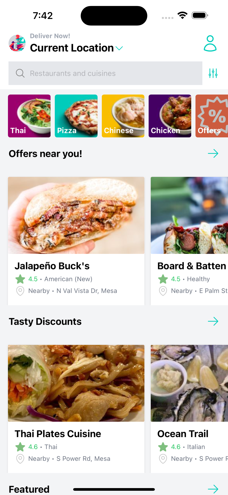
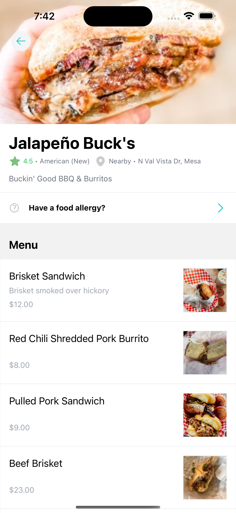
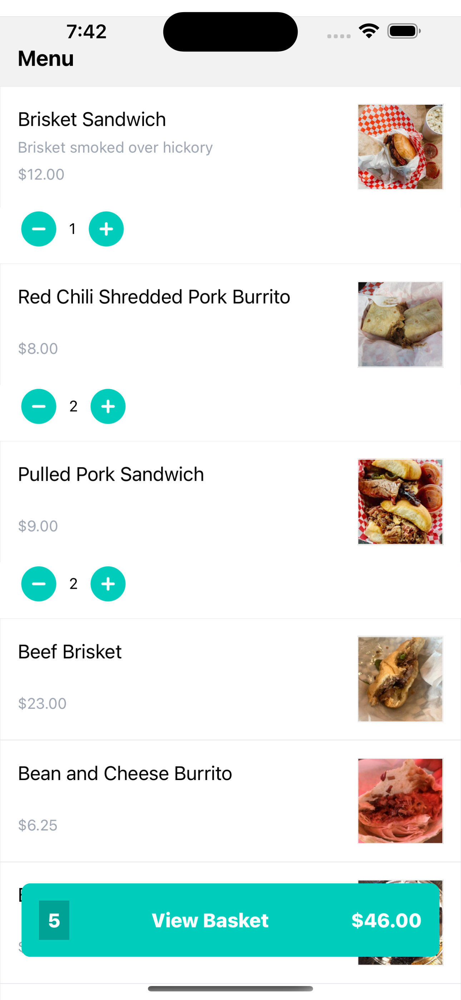
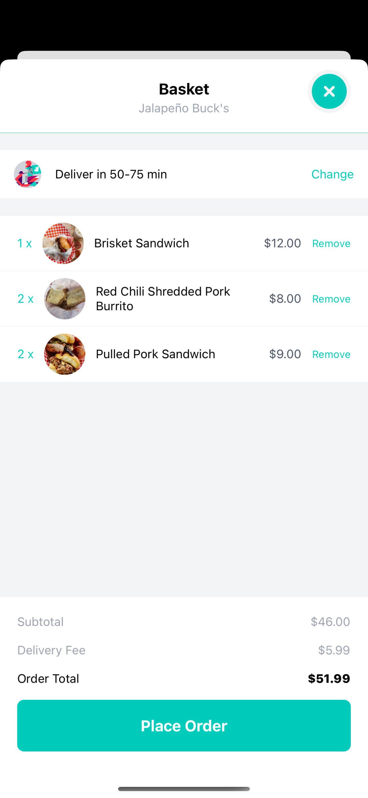
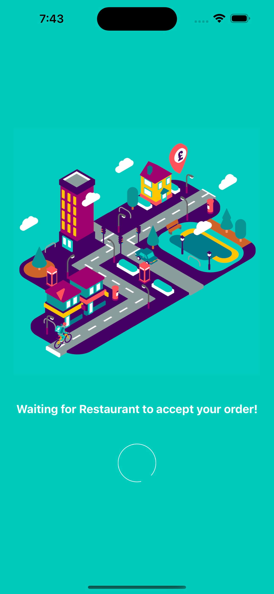
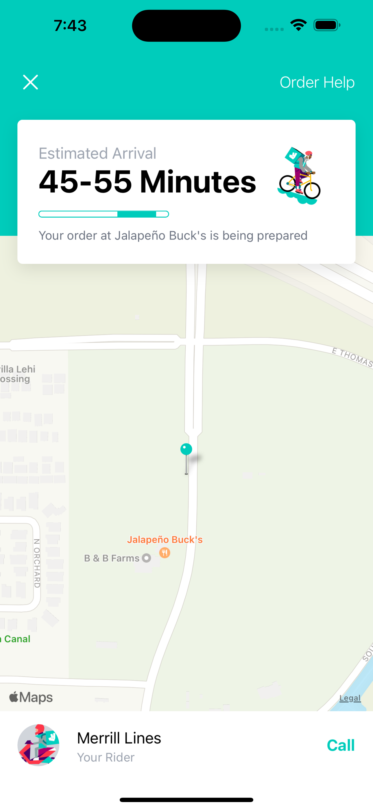

# Deliveroo Clone

iOS/Android React Native project of [Deliveroo](https://deliveroo.co.uk/). Built using REACT NATIVE with (Navigation, Redux, Tailwind CSS & Sanity.io)

## Screenshots

&nbsp; &nbsp; &nbsp; &nbsp;&nbsp; &nbsp; &nbsp; &nbsp;

&nbsp; &nbsp; &nbsp; &nbsp;&nbsp; &nbsp; &nbsp; &nbsp;

#### 🔴 Open the camera app on your device and scan the code below

 

### :space_invader: Tech Stack

  
Client

  <ul>
    <li><a href="https://#/">Javascript</a></li>
    <li><a href="https://docs.expo.dev/workflow/expo-cli">Expo</a></li>
    <li><a href="https://reactnative.dev">React Native</a></li>
     <li><a href="https://tailwindcss.com/">TailwindCSS</a></li>
  </ul>

Database

  <ul>
    <li><a href="https://www.sanity.io">Sanity</a></li>
  </ul>

 

